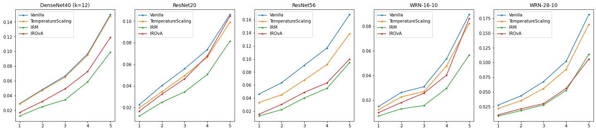

# Calibration Baselines

The goal of Calibration Baselines is to provide a starting point into post-hoc calibration. It is challenging to compare post-hoc calibration methods as they require a pre-trained model whose choice greatly impacts the final calibration. Therefore all methods need to be compared based on the same pre-trained model. By implementing current state-of-the-art methods with simple and concise code, this repo will ease the burden of researchers starting in the field.

## Requirements

TBD

## Methods

Currently the following methods are included:
 - Temperature Scaling (TS)
 - Vector Scaling (VS)
 - Matrix Scaling (MS)
 - Matrix Scaling w/ ODIR (MS-ODIR)
 - Dirichlet w/ L2 regularization (Dir-L2)
 - Dirichlet w/ ODIR (Dir-ODIR)
 - Ensemble Temperature Scaling (ETS)
 - Accuracy preserving Isotonic Regression (IRM)
 - Accuracy preserving Isotonic Regression with Temperature Scaling (IRM-TS)
 - Isotonic Regression One vs All (IROvA)
 - Isotonic Regression One vs All with Temperature Scaling (IROvA-TS)

## Getting started

Create a folder named 'datasets' and place your datasets there.

## Methods

Currently the following datasets are supported:
 - [CIFAR-10/100](https://www.cs.toronto.edu/~kriz/cifar.html)
 - [SVHN](http://ufldl.stanford.edu/housenumbers)
 - [ImageNet-1K](http://www.image-net.org)

The following datasets are available to evaluate ood calibration:
 -  [CIFAR-10/100-C](https://github.com/hendrycks/robustness)
 -  [STL10](https://cs.stanford.edu/~acoates/stl10/)
 -  [CIFAR-10.1 (v4, v6)](https://github.com/modestyachts/CIFAR-10.1)

To download all datasets, except ImageNet, simply run
```bash
python download_datasets.py
```


## Training/Evaluation

To train and evaluate some of the post-hoc calibration methods on CIFAR10 use the command

```bash
python run_cifar10.py
```

## Results

The results will be saved in the folder `data`. Here are some preliminary results for CIFAR10. For the same architecture, each model is calibrated 5 times on 5 different splits and the results are averaged. Below we display the Top1 ECE calibration error.

#### CIFAR10 - IID Calibration

|    Architecture    | Vanilla |  TS  |  VS  |  MS  | MS-ODIR | Dir-L2 | Dir-ODIR |  ETS |    IRM.  |   IROvA   |
|:------------------:|:-------:|:----:|:----:|:----:|:-------:|:------:|:--------:|:----:|:--------:|:---------:|
| DenseNet-40 (k=12) |    2.14 | 2.15 | 1.65 | 1.62 |    1.76 |   1.79 |     1.79 | 2.64 | **0.85** |    0.88   |
|           ResNet20 |    1.18 | 1.03 | 1.01 | 1.09 |    1.12 |   0.98 |     1.11 | 1.18 | **0.75** |    0.79   |
|           ResNet56 |    2.47 | 2.06 | 1.68 | 1.84 |    1.73 |   2.23 |     1.74 | 2.85 | **0.54** |    0.85   |
|          WRN-16-10 |    0.82 | 0.69 | 0.82 | 0.90 |    0.82 |   0.78 |     0.83 | 1.03 |   0.62   |  **0.53** |
|          WRN-28-10 |    1.36 | 1.39 | 1.11 | 1.07 |    1.09 |   1.36 |     1.10 | 2.14 | **0.52** |    0.63   |

#### CIFAR10 - OOD Calibration (CIFAR10-C)



## References

Methods from the following papers were added:
 - [On Calibration of Modern Neural Networks](https://arxiv.org/abs/1706.04599)
 - [Beyond temperature scaling: Obtaining well-calibrated multi-class probabilities with Dirichlet calibration](https://arxiv.org/abs/1910.12656)
 - [Mix-n-Match: Ensemble and Compositional Methods for Uncertainty Calibration in Deep Learning](https://arxiv.org/abs/2003.07329)

To be added:
 - [Intra Order-preserving Functions for Calibration of Multi-Class Neural Networks](https://arxiv.org/abs/2003.06820)

## Acknowledgement

Given that the focus is on post-hoc calibration methods, we use pre-trained models, which are obtained from [imgclsmob](https://github.com/osmr/imgclsmob), (already cloned into this repo).

The code for Matrix Scaling, Diriclet Calibration and respective variants was adapted from official code repository for Dirichlet Calbiration: [Dirichlet Calibration Python implementation](https://github.com/dirichletcal/dirichlet_python).
